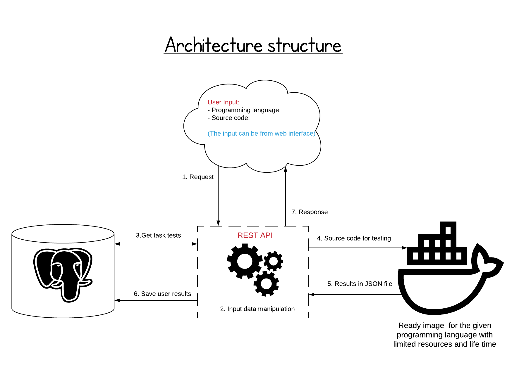

# Project ISIS
## Overview
Project ISIS is my thesis work for bachelor's degree in Technical University of Sofia (2019).  
The main idea of the project is a simple testing environment for source code based on inputs/outputs from STDIN/STDOUT.
Something like Hackerrank (https://www.hackerrank.com) or the Bulgarian project from Software University (https://judge.softuni.bg/).

## Tech stack
Programming language:
 - perl; 

Database engine:

 - PostgreSQL;

Containerization:
 - Docker;
 
## 10,000 m View

## 1,000 m View
// TODO: Add others architecture images
